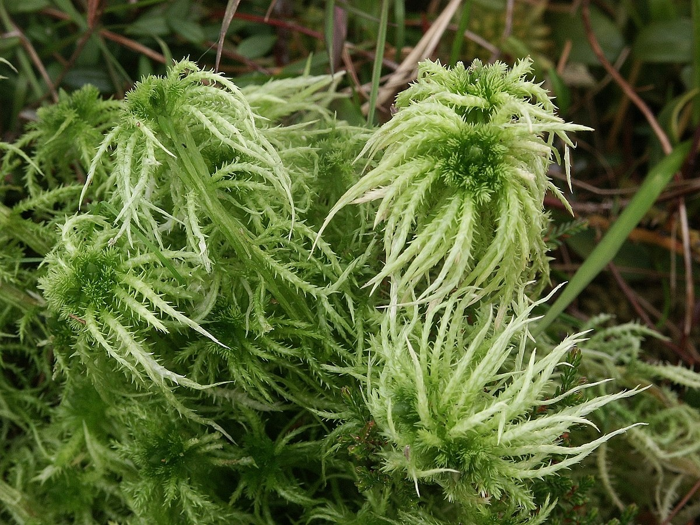

## Sphagnum protruding

This genus includes over 300 species, and in Russia, just imagine, there are about 40 species of sphagnum mosses.

In the textbook, you have already read about the structure of sphagnum, learned that this amazing moss can absorb and retain 20-25 times its own weight in its stems and thin leaves of moisture. This property is explained by the peculiarities of the cellular structure. Sphagnum has two types of cells: some are small green cells, contain chlorophyll, and participate in photosynthesis; others are large, dead, empty, communicating with each other, capable of accumulating and retaining water in themselves. In aquifer cells, sphagnum stores water for a rainy day.

For the growth and development of sphagnum, soft water is needed - it is water that does not contain mineral salts. This water is rainwater. The presence of calcium salts in the water (this water is called hard), in the presence of which the sphagnum gradually stops growing, acts especially depressing on the vital activity of sphagnum. Therefore, on moist soil, which contains mineral salts, only some species of sphagnum settle and develop.

The surface of the marshes and the soil of humid forests is covered with powerful sphagnum carpets.

Sphagnum bogs, like giant sponges, absorb and absorb all the precipitation that falls throughout the year. And then, very economically and gradually, they give this moisture to large and small rivers, stopping their drying out even in the hottest periods of summer heat and drought. In this regard, ill-considered and unreasonable drainage of swamps can cause a real ecological catastrophe.

Sphagnum mosses are constantly growing at their top, and their lower parts die off. Sphagnum is called bog moss.

Accumulating year after year, dead mosses form peat deposits. In the mass of peat, deprived of oxygen and rich in special substances that kill microorganisms, harmful fungi and bacteria do not develop. Peat literally "preserves" everything that gets into it. Therefore, it is no coincidence that in the past, bones of long-extinct animals and household items are often found in the thickness of peat in the past, and even now. In one swamp, the remains of a warrior in full knightly equipment were discovered. People have long used sphagnum not only as a dressing material, but also as a disinfectant, replacing iodine with it. In wounds closed with sphagnum, purulent bacteria do not develop.
 
Sphagnum is difficult to confuse with other leafy mosses, not only because the stems and the upper part of each plant are pale green, and the lower one is white, but also because three small round sporogonums rise up among the rosette of leaves.

